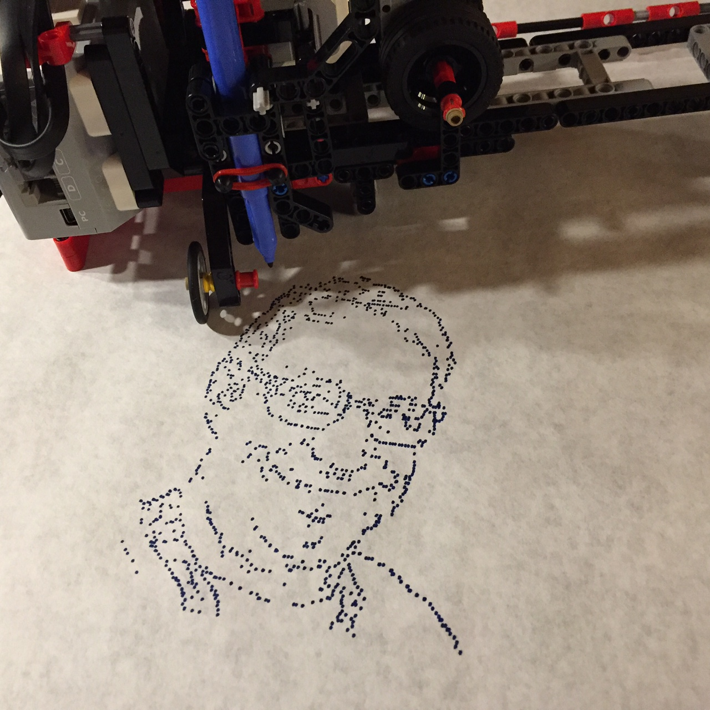
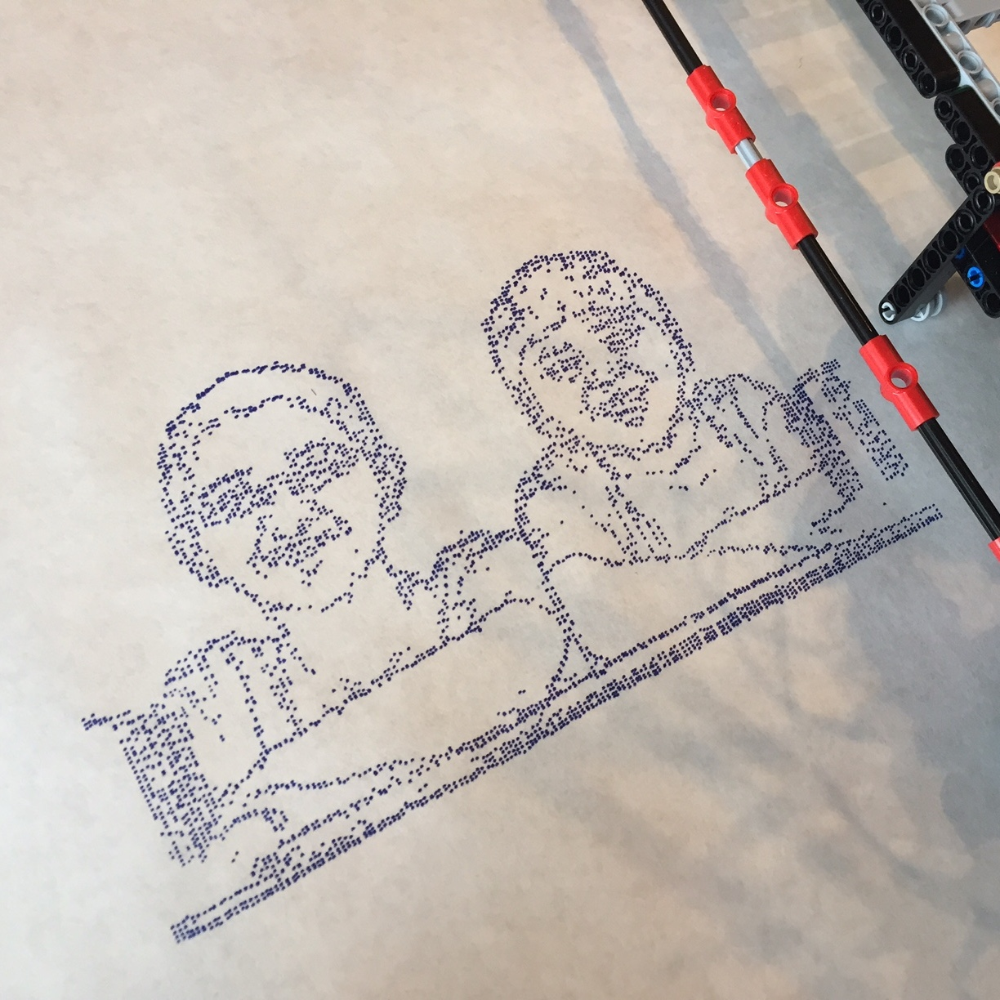
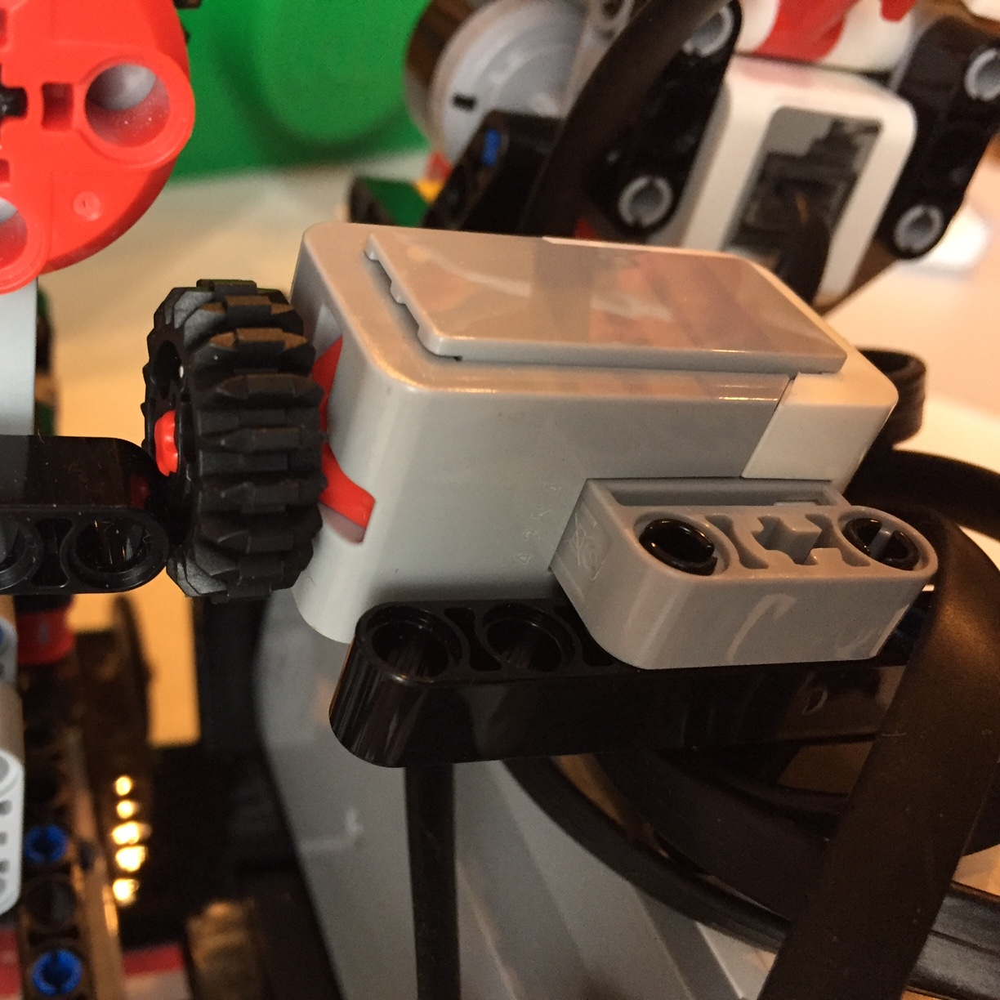
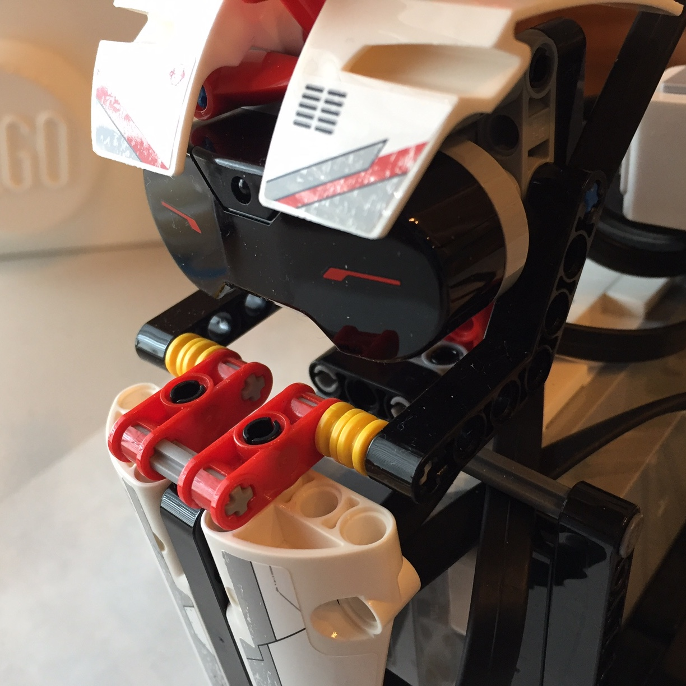

This version of PIX3L PLOTT3R is made with just one 31313 set. Watch this YouTube Video to see the robot in action before you begin.

**Step 1: Build Model** [Instructions coming soon]

**Step 2: Get Paper** Tape a large piece of paper down on a hard surface. This will ensure that the paper does not move as the robot drives across.

**Step 3: Add Pen to Pen Holder** Insert pen as shown and secure with LEGO rubberband. Adjust the pen holder's height (light green circles) by removing extra LEGO pieces or moving the top of the holder to the right as needed for your particular pen. SCRIB3 has been designed for narrower-style markers, but can accomodate both taller markers (Prang, Crayola) or shorter ones (Faber-Castel). You will know that you pen is in the right location if you can turn the gear (marked in red) by hand and the pen nib just touches the paper and leaves a dot. Test in one corner of your paper or on a scrap paper before running the program.

**Step 4: Adjust Code** We have created different images you can choose from. We have set up the code to have four images at a time. The default images in the code are: A photo of the Seshan Brothers who created this project, the Taj Mahal, MINDSTORMS Expert Marc-Andre Bazergui and XX.  You can either print one of those four, or upload your own images and modify the code.  Note: To create alternative images in a format that is recognized by the EV3, you will have to run a small Python Script.

**Step 5: Download Images** Download the four images to Brick. See EV3Lessons.com --> Advanced --> Files if you do not know how to add the images to the brick.

**Step 6: Start Printing** Run the SCRIB3 Program on the EV3 brick. Place SCRIB3 such that the print area will always be on the paper (as it moves across). Make sure that the printer head (the part that holds the pen is moved to the far left, closest to the brick, so that the touch sensor is pressent.Now use the IR Beacon Remote buttons to pick the images. Each button corresponds to an image.

